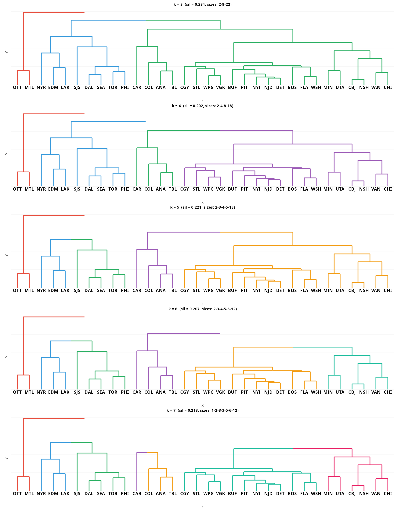
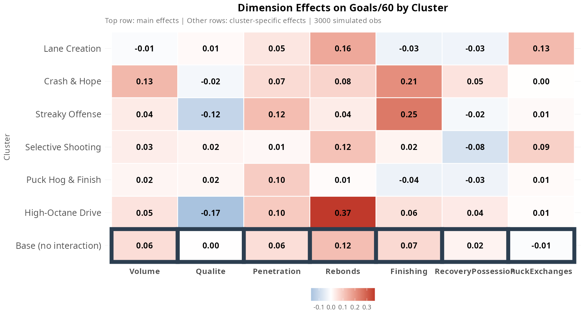
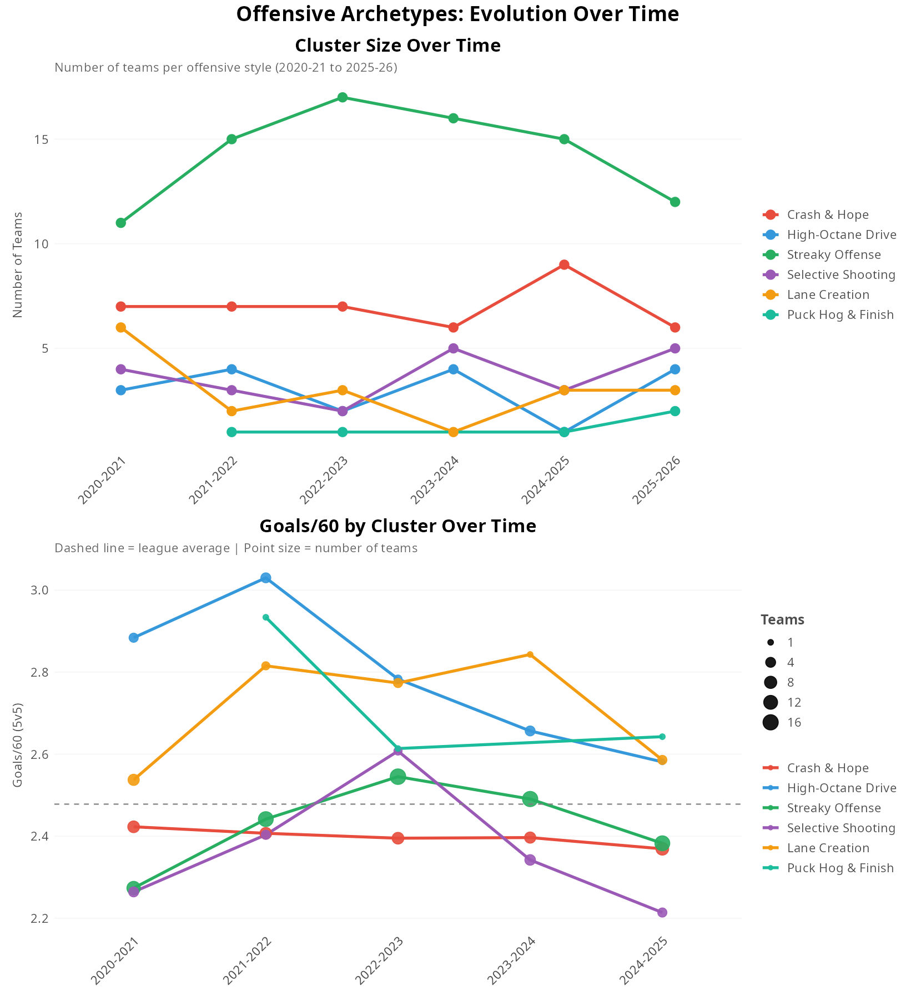
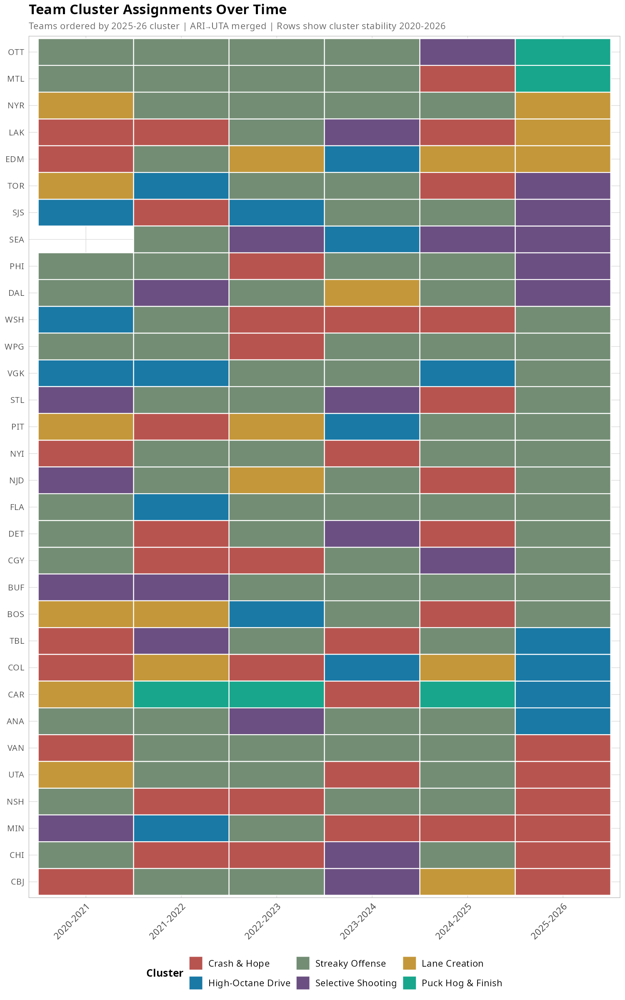

# How NHL Teams Create Offense at 5v5 (2025-26)

> Question: How do NHL teams generate offense at 5v5? Traditional stats (GF, xG) tell us **if** a team produces goals or quality chances, but not **how**. This analysis identifies offensive archetypes and reveals which stylistic choices actually predict success.

---

## Introduction

Traditional offensive stats (GF, xG) measure *results*, not *process*. Two teams can have identical xG/60 but create it in completely different ways.

Instead of asking "how much?", we ask "how?". We decompose offensive style into 7 intuition-based independent dimensions, then identify 6 distinct offensive archetypes across the NHL.

---

## Data & Methodology

Data: MoneyPuck 5v5 statistics, 2025-26 season (32 teams)

Variables: 30+ input variables measuring *how* teams play:
- Shot volume (Corsi, Fenwick, SOG, xG per 60)
- Shot quality (xG/shot, danger ratios HD/MD/LD)
- Penetration (completion rate, blocked/missed)
- Rebounds & second chances
- Miscellaneous: puck recovery (takeaways/giveaways), faceoffs, zone exits, hits

We run a confirmatory factor analysis on each dimension (1 factor per dimension, except Miscellaneous where we force 2 factors). From the factor loadings, we compute dimension scores for each team.

We then apply hierarchical clustering (Ward D2) on these dimension scores. Based on cluster interpretability, we select k=6 archetypes.

---

## Dimensions

| Dimension | What It Measures | Eigenvalue | Variance Explained | Cronbach's α |
|-----------|------------------|------------|-------------------|--------------|
| Volume | Shot quantity, pressure | 5.32 | 88.6% | 0.98 |
| Quality | Shot selection | 4.19 | 52.4% | 0.87 |
| Penetration | Getting shots through | 1.67 | 55.7% | 0.68 |
| Rebounds | Second chance creation | 1.45 | 48.2% | 0.54 |
| Finishing | Converting vs expected | 3.1 | 62% | 0.86 |
| Recovery+Possession | Lots of takeaways, no giveaways, maintaining pressure | 1.75 | 21.9% | 0.52 |
| Puck Exchanges | Takeaways + giveaways | 1.62 | 20.2% | 0.52 |

The Miscellaneous dimension tested better with 2 factors (42.2% vs 21.0% variance explained), so we split it into Recovery+Possession (21.9%) and Puck Exchanges (20.2%).

The Misc dimension splits into 2 factors:
- Recovery+Possession: lots of takeaways, no giveaways, maintaining pressure
- Puck Exchanges: frequent turnovers (high giveaways+takeaways, low hits/penalties)

Using these loadings as weights, we compute a composite score for each team on every dimension.
Here is how each NHL team profiles across these 7 dimensions in 2025-2026:

[texte d'interprétation]

---

## Creating Offensive Archetypes

### How Many Archetypes?

Silhouette analysis suggests **k=6** balances cluster cohesion with interpretability.

The dendrogram with k=6 reveals natural groupings:

[Donc ici on interprète les clusters selon k=6 et la heatmap en-dessous. Séparer la heatmap par cluster avec facet wrap]

[Mettre le même graph pour les autres k en annexe]

### Interpreting and Naming Archetypes

[Interprétation rapide]

| Cluster | Name | Style Signature | Example Teams |
|---------|------|-----------------|---------------|
| **1** | Crash & Hope | High volume + rebounds, poor finishing | CBJ, CHI, MIN, NSH, UTA, VAN |
| **2** | High-Octane Drive | Extreme volume + rebounds, tempo-driven | ANA, CAR, COL, TBL |
| **3** | Streaky Offense | Average everywhere, performance driven by finishing | BOS, DET, NJD, PIT... (12 teams) |
| **4** | Selective Shooting | Low volume, elite shot quality, efficient | DAL, PHI, SEA, SJS, TOR |
| **5** | Lane Creation | Exceptional penetration, creates high-quality lanes | EDM, LAK, NYR |
| **6** | Puck Hog & Finish | Elite recovery + above-expected finishing | MTL, OTT |

---

## [What Drives Success? trouver un titre clair pour cette section]

**What actually drives offensive production?**

We measure success by Goals/60—the purest output metric.

[Interprétation assez in depth]
[High-Octane Drive est le meilleur en moyenne]
[Puck Hog & FInish est le 2e en moyenne]
[Ce sont les 2 seuls clusters qui ont seulement des équipes au-dessus de la moyenne de la ligue]
[Grosse séparations pour Selective Shooting, Streaky Offense et Crash & Hope]
[Lane Creation est difficile à interpréter]

### Separation Within Clusters

[What separates above-average from below-average teams in each cluster?]

**Method:** Bootstrap regression (500 obs/cluster) with cluster-specific interactions

[Interprétation: à travers tlm: rebounds, finishing les plus importants]
[Puck Hog & Finish: difficile à interpréter évidemment avec 2 équipes, Penetration semble avoir un petit effet positif.]
[Streaky Offense: on voit à quel point le succès est volatile, dépend du finishing]
[Crash & Hope: même chose, dépend bcp du finishing mais aussi du volume]
[High-Octane Drive: dépend beaucoup des rebounds]
[Selective Shooting et Lane Creation: rebounds]

[Est-ce qu'on devrait ensuite montrer descriptivement la relation succès-dimension pour chaque cluster? Avant le test? en Annexe?]

---

## Do These Styles Exist in Past Seasons?

> Method: Apply the 2025-26 clustering model to historical seasons (assuming the 6 archetypes are stable over time)

---

## Next Steps

> Next step: Re-run clustering on all 5 historical seasons + 2025-26 (191 team-seasons) to identify stable offensive archetypes

Questions to explore:

- Do we get similar clusters with more data?
- Which clusters are "real" (stable over time) vs season-specific?
- How do team trajectories look when clusters are defined historically?
- Are the Habs and Sens really creating a new offensive approach?

> Another potential next step: Running a similar analysis on "achieving defense"

Questions to explore:

- Does a relationship exist between the success of an offensive approach and the success of a defensive approach against that style?

---

## Data & Methods

**Data Source:** [MoneyPuck](https://moneypuck.com/teams.htm) - 5v5 team statistics

**Technical Stack:**

- **Python:** requests, pandas (data scraping)
- **R:** tidyverse, psych, cluster, clessnize, ggplot2 (analysis & viz)

**Outputs:** `outputs/figures/` and `outputs/tables/`

---

## Appendix

- [Full code in `scripts/`](scripts/)
- [Cluster assignments: `teams_with_scores.csv`](outputs/tables/teams_with_scores.csv)
- [Dimension loadings: `dimension_loadings.csv`](outputs/tables/dimension_loadings.csv)
