# How NHL Teams Create Offense at 5v5 (2025-26)

> Question: How do NHL teams generate offense at 5v5? Traditional stats (GF, xG) tell us **if** a team produces goals or quality chances, but not **how**. This analysis identifies offensive archetypes and reveals which stylistic choices actually predict success.

## Introduction

Traditional offensive stats (GF, xG) measure *results*, not *process*. Two teams can have identical xG/60 but create it in completely different ways.

Instead of asking "how much?", we ask "how?". We decompose offensive style into 6 process dimensions that describe *how* teams create chances, then identify 5 distinct offensive archetypes across the NHL.

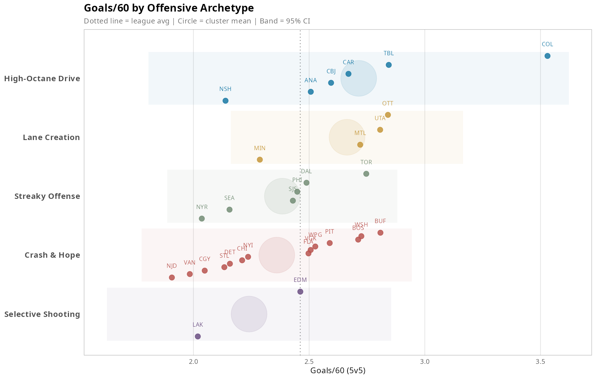

## Data & Methodology

Data: MoneyPuck 5v5 statistics, 2025-26 season (32 teams)

Variables organized by dimension: 30+ input variables measuring *how* teams play:
- Shot volume (Corsi, Fenwick, SOG, xG per 60)
- Shot quality (xG/shot, danger ratios HD/MD/LD)
- Penetration (completion rate, blocked/missed)
- Rebounds & second chances
- Miscellaneous: puck recovery (takeaways/giveaways), faceoffs, zone exits, hits

We run a confirmatory factor analysis on each dimension (1 factor per dimension, except Miscellaneous where we force 2 factors). From the factor loadings, we compute dimension scores for each team.

A 7th dimension, *Finishing*, is computed the same way but treated separately: it measures conversion efficiency rather than style, so it's excluded from clustering and used later to assess which archetypes benefit most from strong finishing.

We then apply hierarchical clustering (Ward D2) on the 6 style dimension scores (excluding Finishing). Based on cluster interpretability, we select k=5 archetypes.

## Dimensions

Style dimensions (used for clustering):

| Dimension | What It Measures | Eigenvalue | Variance Explained | Cronbach's α |
|-----------|------------------|------------|-------------------|--------------|
| Volume | Shot quantity, pressure | 5.32 | 88.6% | 0.98 |
| Quality | Shot selection (as a ratio) | 4.19 | 52.4% | 0.87 |
| Penetration | Getting shots through | 1.67 | 55.7% | 0.68 |
| Rebounds | Second chance creation | 1.45 | 48.2% | 0.54 |
| Recovery+Possession | Lots of takeaways, no giveaways, maintain pressure | 1.75 | 21.9% | 0.52 |
| Puck Exchanges | Takeaways + giveaways | 1.62 | 20.2% | 0.52 |

> The Miscellaneous dimension tested better with 2 factors (42.2% vs 21.0% variance explained), so we split it into Recovery+Possession (21.9%) and Puck Exchanges (20.2%).

Intermediate dimension (computed the same way, excluded from clustering):

| Dimension | What It Measures | Eigenvalue | Variance Explained | Cronbach's α |
|-----------|------------------|------------|-------------------|--------------|
| Finishing | Converting vs expected (Sh% vs xSh%, goals above expected) | 3.1 | 62% | 0.86 |

> Finishing is a composite score derived from 5 conversion metrics (shooting percentage vs expected, goals above expected, conversion by danger level). Like the style dimensions, it's computed via single-factor analysis and expressed as a z-score. But it captures *how well* a team converts its chances, not *how* it creates them. Including it in clustering would mix outcomes with style, so we keep it separate and bring it back in subsequent analyses to test which archetypes benefit most from strong finishing.

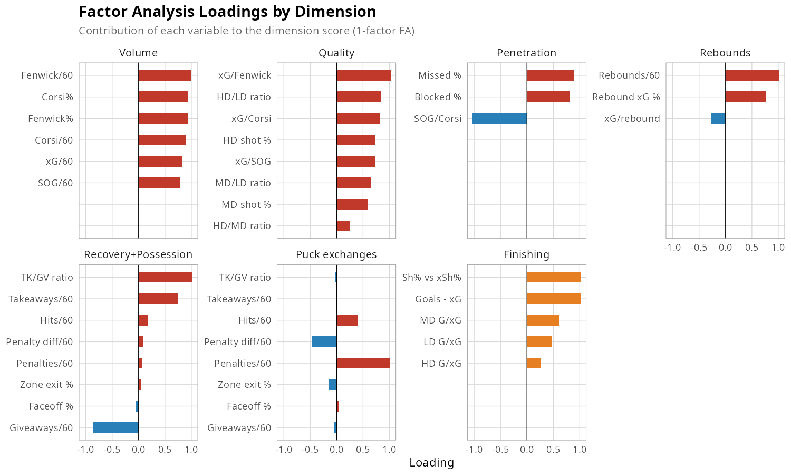

The Misc dimension splits into 2 factors:
- Recovery+Possession: lots of takeaways, no giveaways, maintaining pressure
- Puck Exchanges: frequent turnovers (high giveaways+takeaways, low hits/penalties)

Using these loadings as weights, we compute a composite score for each team on every dimension.
Here is how each NHL team profiles across these 7 dimensions in 2025-2026:

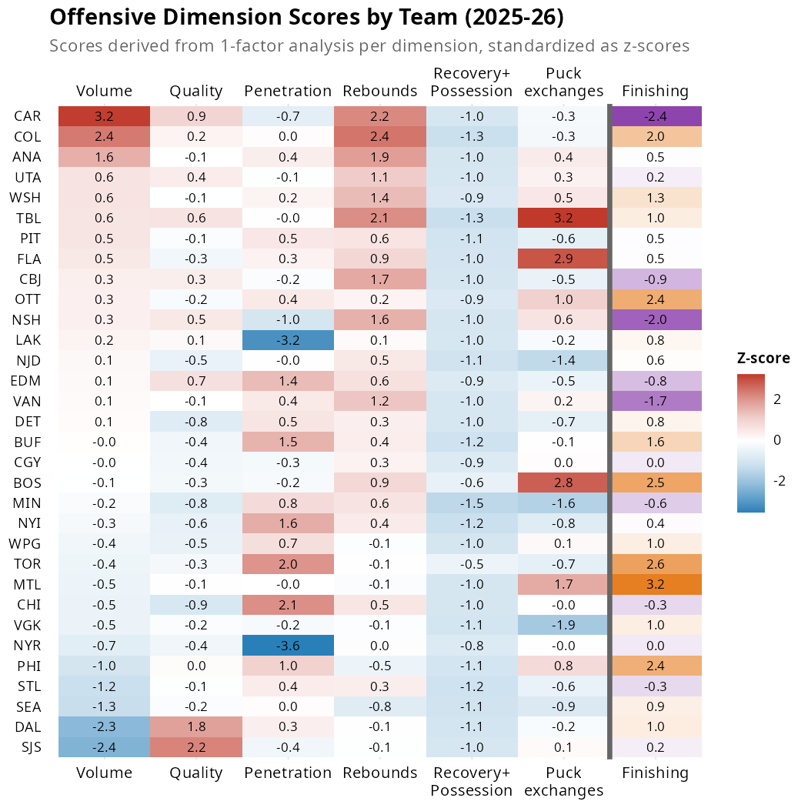

A few scores stand out already.
- Carolina and Colorado have high *Volume* and *Rebounds* scores, suggesting they generate a lot of shots and create second chances.
- Montreal and Ottawa have high *Recovery+Possession* and low *Puck exchanges*, suggesting they win the puck back and keep it rather than trading turnovers.
- Edmonton and LA have high *Quality* and *Penetration*, suggesting they get pucks through to dangerous areas before shooting.
- San Jose has the highest *Quality* score but the lowest *Volume*. Since *Quality* is built from ratios (xG/shot, danger%), this likely reflects a team that shoots less, but selects high-danger opportunities when it does. 

## Creating Offensive Archetypes

With 6 dimension scores per team, we can now group teams that play similarly. We use Ward's D2 hierarchical clustering on the raw z-scores: it minimizes within-cluster variance at each merge, producing compact groups, and the dendrogram lets us inspect how teams relate before choosing k.

### How Many Archetypes?

We select k using a combination of standard Ward D2 metrics (merge height, within-cluster SS, silhouette), but mostly cluster interpretability.

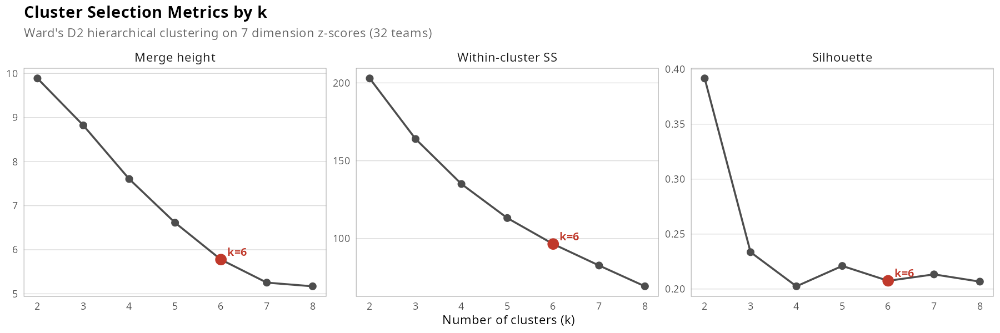

No single k dominates across all three metrics.

- k=4 has low silhouette (0.211) and produces clusters that are too broad.
- k=5 creates a singleton (SJS) and keeps EDM-LAK merged with the NYR-TOR-DAL-PHI-SEA group.
- k=6 has the highest silhouette (0.236), splits EDM-LAK into their own cluster, and keeps SJS as a singleton.
- k=7 fragments further without adding insight (see [Appendix](#appendix) for dendrograms by k).

We start with k=6. Below, the dendrogram paired with a heatmap of dimension scores (same team ordering).

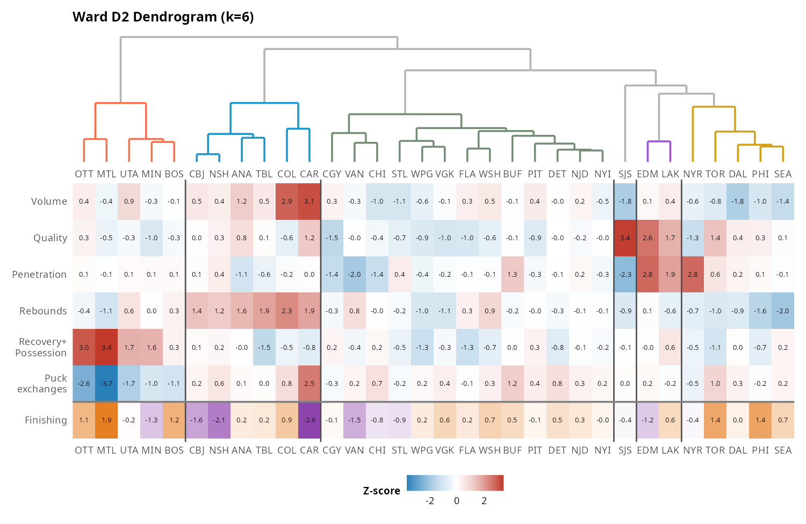

> Refinement: the k=6 solution produces one singleton (SJS) and one team with negative silhouette (BOS, at -0.22, placed in the cluster with high *Recovery+Possession* scores despite being closer to the peloton on this dimension). We reassign both algorithmically: the negative-silhouette team moves to its nearest neighbor cluster, and the singleton merges into its closest cluster. This yields 5 final archetypes. The process is automatic and reproducible (see code in `04_analysis_cluster_assignments.R`).

### Interpreting and Naming Archetypes

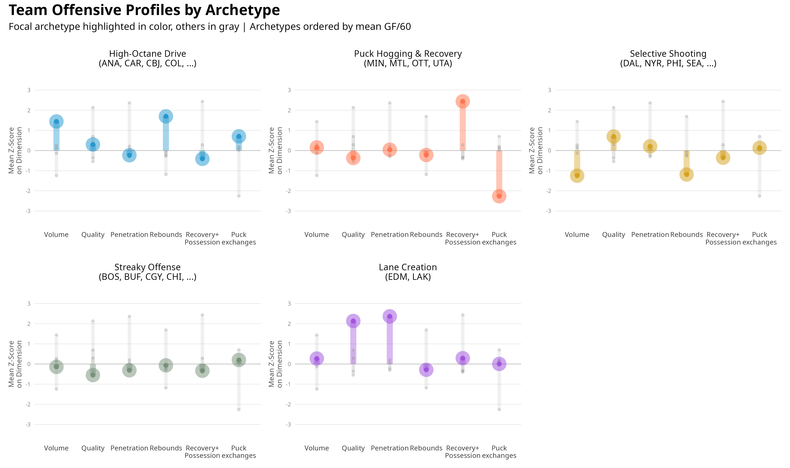

| Archetype Name | Style | Example Teams |
|------|-----------------|---------------|
| High-Octane Drive | Fast tempo, drive the net, lots of rebounds | ANA, CAR, COL, NSH, TBL |
| Puck Hogging & Recovery | Aggressive puck control, keep possession | MIN, MTL, OTT, UTA |
| Selective Shooting | Low volume but above-average quality, selects their shooting opportunities | DAL, NYR, PHI, SEA, SJS, TOR |
| Streaky Offense | Average everywhere, finishing-dependent (volatile) | BOS, BUF, CGY, DET... (14 teams) |
| Lane Creation | Create quality shooting lanes | EDM, LAK |

## What Drives Production?

Now that we have archetypes, which ones actually produce? We measure offensive output by Goals/60 at 5v5.

The two proactive styles lead in production, but their paths differ.

- *High-Octane Drive* and *Puck Hogging & Recovery* are the only clusters above league average (2.71 and 2.66 GF/60). The means are close, but the variance is not. *High-Octane Drive* has the highest ceiling (COL at 3.53) and the largest spread (SD 0.463) as NSH scores just 2.14 despite playing the same style.

- *Puck Hogging & Recovery* is the most consistent cluster (SD 0.256), with three of four teams between 2.72 and 2.84 GF/60. Only MIN (2.29) trails.

- *Streaky Offense* (n=14) has the widest internal spread: BUF scores 2.81 GF/60, NJD just 1.91. These teams are average on every style dimension: what separates them is finishing, which is volatile.

- *Selective Shooting* and *Lane Creation* both sit below league average, with large internal gaps. TOR leads its cluster at 2.75 while NYR sits at 2.04. *Lane Creation* (n=2) is hard to generalize, as EDM is near league average, LAK well below.

> A version of this graph with xGF/60 is available in the [Appendix](#appendix).

### Which Dimensions Drive Production Within Archetypes?

Within each archetype, teams share a similar style but produce very different results. Below, each dimension score is plotted against Goals/60 per cluster. The dashed line is a simple linear trend.

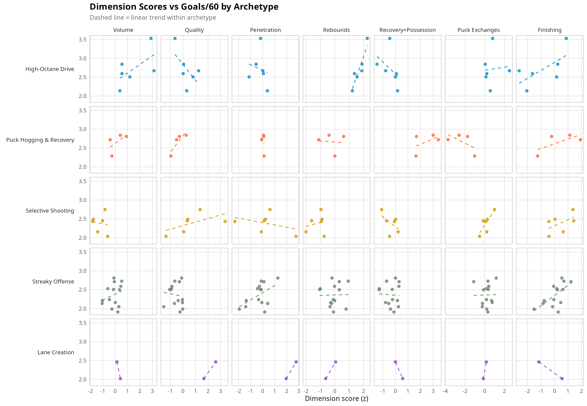

Finishing has a positive slope in almost every row, steepest in *Streaky Offense*.
Rebounds tilt upward in *High-Octane Drive*, while Quality slopes *negatively*: the teams in this cluster that score most are the ones throwing pucks at the net with traffic, not the ones picking their shots.

To quantify these visual trends, we run a bootstrap regression with cluster-specific interactions. With clusters of 2 to 14 teams, we can't claim causality, but the coefficients do show which dimensions correlate with production within each archetype, controlling for the others.

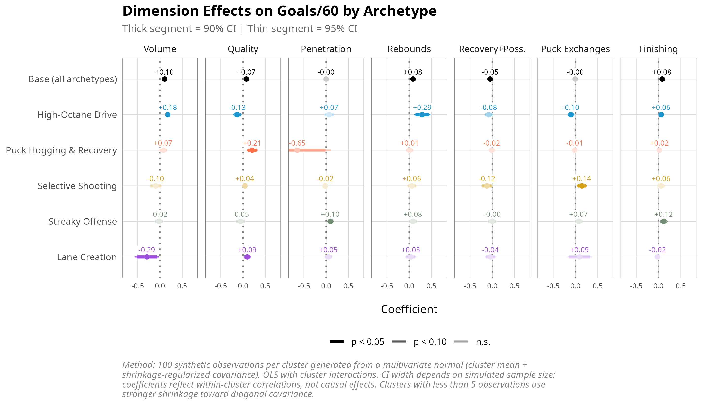

Across all archetypes (top row), Volume, Quality, Rebounds and Finishing have the strongest positive effects on Goals/60. Within clusters, some interesting trends emerge.
- *High-Octane Drive*'s biggest lever is Rebounds (+0.29), while Quality is negative (-0.13): shoot more, shoot through traffic.
- *Puck Hogging & Recovery* is driven by Quality (+0.21), suggesting this archetype benefits from being patient and waiting for good opportunities.
- *Streaky Offense* has the largest Finishing effect of any cluster (+0.12). With no style dimension standing out, production is mostly driven by being able to convert.

## Do These Archetypes Exist in Past Seasons?

> Method: Apply the 2025-26 clustering model to historical seasons (assuming the 5 archetypes are stable over time)

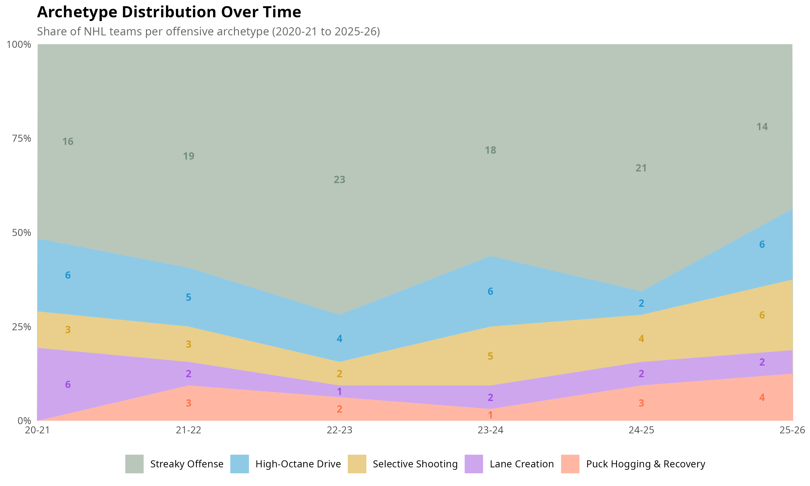

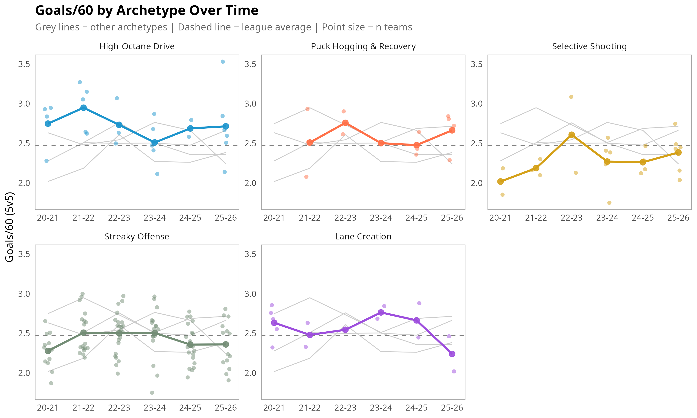

## Next Steps

> Next step: Re-run clustering on all 5 historical seasons + 2025-26 (191 team-seasons) to identify stable offensive archetypes

Questions to explore:

- Do we get similar clusters with more data?
- Which clusters are "real" (stable over time) vs season-specific?
- How do team trajectories look when clusters are defined historically?
- Are the Habs and Sens really creating a new offensive approach?

> Another potential next step: Running a similar analysis on "achieving defense"

Questions to explore:

- Does a relationship exist between the success of an offensive approach and the success of a defensive approach against that style?

## Data & Methods

**Data Source:** [MoneyPuck](https://moneypuck.com/teams.htm) - 5v5 team statistics

**Technical Stack:**

- **Python:** requests, pandas (data scraping)
- **R:** tidyverse, psych, cluster, clessnize, ggplot2 (analysis & viz)

**Outputs:** `outputs/figures/` and `outputs/tables/`

## Appendix

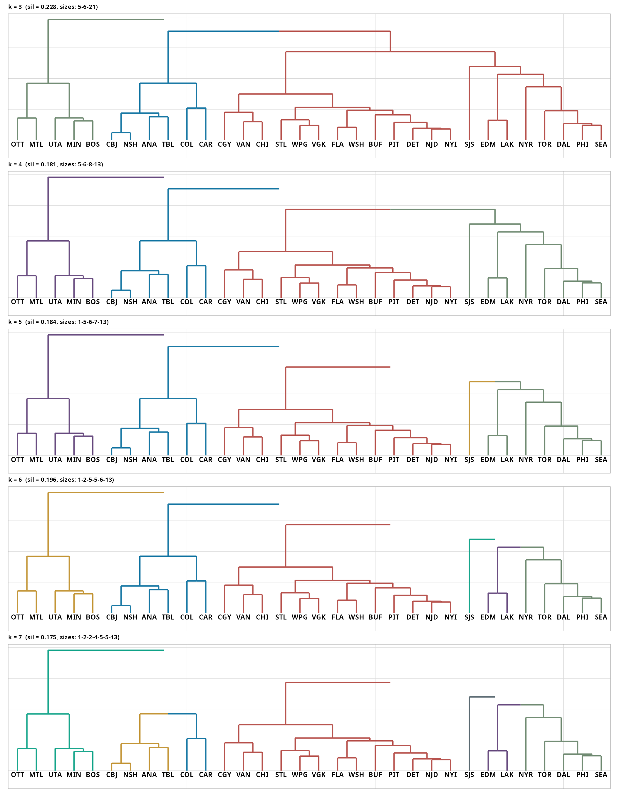

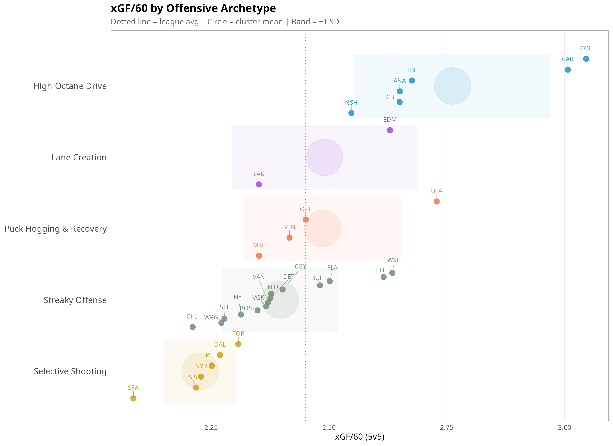

- [Full code in `scripts/`](scripts/)
- [Cluster assignments: `teams_with_scores.csv`](outputs/tables/teams_with_scores.csv)
- [Dimension loadings: `dimension_loadings.csv`](outputs/tables/dimension_loadings.csv)
